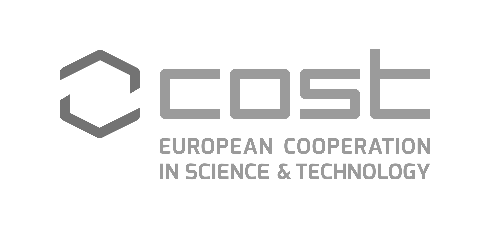

  

Which of these images best represents the meaning of the phrase ___bad apple___ in the following sentence?:

> "We have to recognize that this is not the occasional bad apple but a structural, sector-wide problem"

How about here?

> "However, if ethylene happens to be around (say from a bad apple), these fruits do ripen more quickly."

Even if you aren't already familiar with the non-literal idiomatic meaning of _bad apple_ (an individual whose influence negatively impacts the behaviour or reputation of a group or organisation), as a human you might be able to answer this question fairly easily.

Computational language models, on the other hand, struggle with figurative expressions such as these.

By using visual representations like these, the __AdMIRe__ task aims to push participants to improve the quality of model representations of idiomatic expressions and develop models which come closer to "understanding" the semantic meaning of idioms, which are an important feature of natural language.

### Motivation
Comparing the performance of language models (including large LLMs) to humans shows that models lag behind humans in comprehension of idioms ([Tayyar Madabushi et al., 2021](https://doi.org/10.18653/v1/2021.findings-emnlp.294); [Chakrabarty et al., 2022a](https://doi.org/10.18653/v1/2022.emnlp-main.481); [Phelps et al., 2024](https://aclanthology.org/2024.mwe-1.22)). As idioms are believed to be conceptual products and humans understand their meaning from interactions with the real world involving multiple senses ([Lakoff and Johnson, 1980](https://doi.org/10.1207/s15516709cog0402_4); Benczes, 200), we build on the previous SemEval-2022 Task 2 ([Madabushi et al., 2022](https://doi.org/10.18653/v1/2022.semeval-1.13)) and seek to explore the comprehension ability of multimodal models. In particular, we focus on models that incorporate visual and textual information to test how well they can capture representations and whether multiple modalities can improve these representations.

Good representations of idioms are crucial for applications such as sentiment analysis, machine translation and natural language understanding. Exploring ways to improve models’ ability to interpret idiomatic expressions can enhance the performance of these applications. For example, due to poor automatic translation of an idiom, the Israeli PM appeared to call the winner of Eurovision 2018 a ‘real cow’ instead of a ‘real darling’! Our hope is that this task will help the NLP community to better understand the limitations of contemporary language models and to make advances in idiomaticity representation.

Several previous tasks have explore how language models represent idiomaticity. However, as highlighted by [Boisson et al (2023)](https://doi.org/10.18653/v1/2023.emnlp-main.406), artifacts present in these datasets may allow models to perform well at the idiomaticity detection task without necessarily developing high-quality representations of the semantics of idiomatic expressions. 

### Task Details
We present two subtasks which we hope will address these shortcomings by moving away from binary classification and by introducing representations of meaning using visual and visual-temporal modalities, across two languages, English and Portuguese.

In order to reduce potential barriers to participation, we also provide a variation of both subtasks in which the images are replaced with text captions describing their content. Two settings are therefore available for each subtask; one in which only the text is available, and one which uses the images.

The two subtasks are:
#### Subtask A - Static Images
Participants will be presented with a set of 5 images and a context sentence in which a particular potentially idiomatic nominal compound (NC) appears. The goal is to rank the images according to how well they represent the sense in which the NC is used in the given context sentence.

#### Subtask B - Image Sequences (or Next Image Prediction)
Participants will be given a target expression and an image sequence from which the last of 3 images has been removed, and the objective will be to select the best fill from a set of candidate images. The NC sense being depicted (idiomatic or literal) will not be given, and this label should also be output.

More information about the task can be found in the [task description document](/docs/assets/SemEval_2025_Task_1__ADMIRE___Advancing_Multimodal_Idiomaticity_Representation.pdf).

### Data

English training data for both subtasks can be obtained from the [Training Data page](/data/training/training_data.md).

Portuguese training data for Subtask A are also available from the [Training Data page](/data/training/training_data.md).

Development (model/system selection) data are available from the [Development Data page](/data/dev/development_data.md).

Evaluation (competition ranking) data are available from the [Evaluation Data page](/data/test/test_data.md).

Labelled datasets are now available from the [ORDA data repository](https://orda.shef.ac.uk/articles/dataset/AdMIRe_Advancing_Multimodal_Idiomaticity_Representation_SemEval-2025_Task_1_-_Labelled_Datasets/28436600/1).

Scoring scripts (if you want to evaluate the models locally) can be found here: [Subtask A](/data/admire_taska_scoring.zip), [Subtask B](/data/admire_taskb_scoring.zip).

#### Sample Data

See the [Sample Data page](/data/sample/sample_data.md) to explore a small sample of (English) training data for both subtasks A and B.

### Get Involved
To discuss the task and receive information about future developments, join the [mailing list](https://groups.google.com/g/admire-semeval-2025).

The SemEval-2025 competition period has now ended, but the AdMIRe benchmarks remain open on [CodaBench](https://www.codabench.org/) for each of the subtasks, and can be used to evaluate models against the reference data.

**Final leaderboards are now available on the [Results page](/docs/results.md).**

#### Subtask A

- Subtask A [training set](https://www.codabench.org/competitions/4921/) benchmark
- Subtask A [development set](https://www.codabench.org/competitions/4920/) benchmark
- Subtask A [test and extended evaluation](https://www.codabench.org/competitions/4345/) benchmark

#### Subtask B

- Subtask B [training set](https://www.codabench.org/competitions/4923/) benchmark
- Subtask B [development set](https://www.codabench.org/competitions/4922/) benchmark
- Subtask B [test and extended evaluation](https://www.codabench.org/competitions/4814/) benchmark

### Important dates

- [Sample data](/data/sample/sample_data.md) available: 16 July 2024
- Subtask A (English) [Training data](/data/training/training_data.md) now available
- Subtask B (English) [Training data](/data/training/training_data.md) now available
- Subtask A (Bazilian Portuguese) [Training data](/data/training/training_data.md) now available
- [Development data](/data/dev/development_data.md) now available
- [Evaluation data](/data/test/test_data.md) now available
- Extended evaluation data are now available
- ~~Evaluation start 10 January 2025~~
- ~~Evaluation end by 31 January 2025~~
- ~~Paper submission due 28 February 2025~~
- ~~Paper review period 07 March 2025 - 24 March 2025~~
- ~~Notification to authors ~~31 March 2025~~ 07 April 2025~~
- ~~Camera ready due **28 April 2025**~~
- SemEval workshop 31 July - 01 August 2025 (co-located with [ACL 2025](https://2025.aclweb.org/))

All deadlines are 23:59 UTC-12 (["anywhere on Earth"](https://en.wikipedia.org/wiki/Anywhere_on_Earth)).

### Organizers

- [Tom Pickard](https://scholar.google.com/citations?user=rNTmzakAAAAJ&hl=en), University of Sheffield, UK
- [Wei He](), University of Sheffield, UK
- [Maggie Mi](https://mi-m1.github.io/), University of Sheffield, UK
- [Dylan Phelps](https://www.semanticscholar.org/author/Dylan-Phelps/2161561356), University of Sheffield, UK
- [Carolina Scarton](https://carolscarton.github.io/), University of Sheffield, UK
- [Marco Idiart](https://sites.google.com/view/marcoidiart/home), Federal University of Rio Grande do Sul, Brazil
- [Aline Villavicencio](https://sites.google.com/view/alinev), University of Exeter, UK

__Contact:__ <semeval-2025-multimodal-idiomaticity@googlegroups.com>

### SemEval 2025 Resources

- [Frequently Asked Questions about SemEval](https://semeval.github.io/faq.html)
- [Paper Submission Requirements](https://semeval.github.io/paper-requirements.html)
- [Guidelines for Writing Papers](https://semeval.github.io/system-paper-template.html)

### Acknowledgements

The task organisers would like to acknowledge the contributions of our Brazilian collaborators who made this work possible. In particular, our thanks go to Rozane Rebechi, Juliana Carvalho, Eduardo Victor, César Rennó Costa, Marina Ribeiro and their colleagues and students.

This work was supported by the UKRI AI [Centre for Doctoral Training in Speech and Language Technologies (SLT) and their Applications](https://slt-cdt.sheffield.ac.uk/) funded by UK Research and Innovation \[grant number EP/S023062/1\].

This work also received support from the CA21167 COST action UniDive, funded by COST (European Cooperation in Science and Technology).

  
